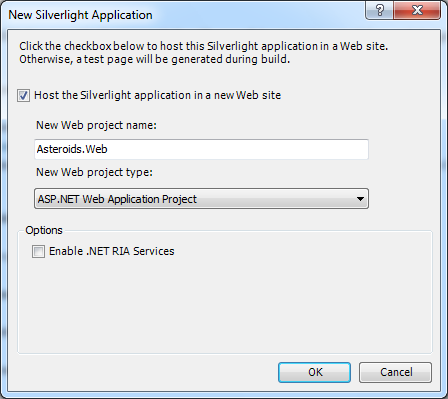
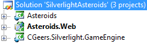
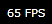

# Silverlight Asteroids Part 1: Game Loop

## Introduction

About two weeks ago I bought a book about [game development with Microsoft Silverlight](https://www.packtpub.com/3d-game-development-with-microsoft-silverlight-3-beginners-guide/book). The first few chapters dealt with the creation of 2D games. The example illustrated in the book was [Space Invaders](http://en.wikipedia.org/wiki/Space_Invaders).

After having read these chapters, I had a go at recreating another old arcade game, namely [Asteroids](<http://en.wikipedia.org/wiki/Asteroids_(video_game)>). If you bing Silverlight Asteroids you'll find a few other implementations of the game. This is the first part of a multi-part series that explains how I went about recreating the game using Silverlight 3 and Visual Studio 2008.

**Remark**: [Silverlight 4](http://www.microsoft.com/downloads/details.aspx?FamilyID=bf5ab940-c011-4bd1-ad98-da671e491009&displaylang=en) was released earlier this week, check it out if you haven't already. You'll need the released version of Visual Studio 2010 for Silverlight 4 development.

The sample code for this article was developed using Silverlight 3 and Visual Studio 2008, but it should work fine if you are already using the newer version. [Beware that there are some issues if you try to install Visual Studio 2010 if you already have the Silverlight 3 SDK installed](http://blogs.msdn.com/amyd/archive/2009/10/21/visual-studio-2010-and-silverlight-3-sdk.aspx).

So let's get started by laying the foundation for the game...

## Setting Up The Solution

Start by launching Visual Studio and creating a new blank solution called "SilverlightAsteroids". Add a new project called Asteroids to it using the Silverlight Application project template.

Be sure to check the option that lets you host the Silverlight application in a new web site. Leave the default name ("Asteroids.Web") for the Web project.

**Figure 1** - Silverlight Application



Last but not least add a Silverlight Class Library project to the solution and call it CGeers.Silverlight.GameEngine. Delete the automatically generated Class1.cs file. This library will contain most of the code that powers your game and you can reuse it to create other simple 2D games. Your solution should now resemble the following screenshot.

**Figure 2** - Your Solution

[

Add a reference to the CGeers.Silverlight.GameEngine project for the Asteroids project.

## The Canvas

A picture is worth a thousand words, Figure 3 shows your Asteroids game in action. At the end of this series you should end up with a game that resembles this.

**Figure 3** - Asteroids In Action


You can immediately recognize some game elements such as asteroids, stars, the spaceship, bullets, explosions...etc. All of these elements will need to be created in order to complete the game. (Thanks to [Andy Beaulieu](http://www.andybeaulieu.com/) for letting me use his XAML code for the design of the spaceship.)

All of these elements need to be painted on a canvas. Open up the MainPage.xaml file in the Asteroids project and replace the default XAML code by the following:

**Listing 1** - MainPage.xaml

```xml
<UserControl x:Class="Asteroids.MainPage"
    xmlns="http://schemas.microsoft.com/winfx/2006/xaml/presentation"
    xmlns:x="http://schemas.microsoft.com/winfx/2006/xaml"
    xmlns:d="http://schemas.microsoft.com/expression/blend/2008"
    xmlns:mc="http://schemas.openxmlformats.org/markup-compatibility/2006"
    Width="1024" Height="768">
    <Canvas x:Name="LayoutRoot" Width="1024" Height="768" Background="Black">
      ...
    </Canvas>
</UserControl>
```

This canvas of 1024 x 768 pixels with a black background represents the space which all of the game elements will inhabit.

## Frames Per Second

You'll need to draw all of the game elements upon this canvas of 1024 x 768 pixels. All of the elements move within this canvas. In order to create the illusion of a smooth animation you'll need a minimum of about 30 frames per second.

For each rendered frame you are in charge of calculating the new position of each game element. By displaying these frames in quick succession you'll get a smooth animation.

You'll need to setup a game loop which notifies you each time you need to render a frame. For this purpose you can use the [DispatcherTimer](http://msdn.microsoft.com/en-us/library/system.windows.threading.dispatchertimer.aspx) class. If you set it's interval property to zero (TimeSpan.Zero) it will be triggered about 60 times per second, which will allow you to draw 60 frames per second. This is more than enough to create a smooth animation.

## Game Surface

Add a new class called GameSurface to the CGeers.Silverlight.GameEngine project. This class will be in charge of notifying us when we need to render a frame. The GameSurface type represents the canvas upon which all game elements will be drawn. There is only one canvas for each game thus this type will implement [the singleton patter](http://www.dofactory.com/Patterns/PatternSingleton.aspx).

Copy the following code into the newly created file.

**Listing 2** - GameSurface Class

```csharp
public class GameSurface
{
    private DispatcherTimer _gameLoop;
    private DateTime _lastTick = DateTime.Now;

    #region Singleton Pattern

    // Static members are lazily initialized.
    // .NET guarantees thread safety for static initialization.
    private static readonly GameSurface _instance = new GameSurface();

    // Make the constructor private to hide it.
    // This class adheres to the singleton pattern.
    private GameSurface()
    {
        this._gameLoop = new DispatcherTimer { Interval = TimeSpan.Zero };
        this._gameLoop.Tick += GameLoopTick;
    }

    /// <summary>
    /// Return the single instance of the GameSurface type.
    /// </summary>
    /// <returns>GameSurface</returns>
    public static GameSurface GetInstance()
    {
        return _instance;
    }

    #endregion

    private void GameLoopTick(object sender, EventArgs e)
    {
        RenderFrameEventArgs eventArgs = new RenderFrameEventArgs
            { ElapsedTime = DateTime.Now - this._lastTick };
        this._lastTick = DateTime.Now;
        if (this.RenderFrame != null)
        {
            this.RenderFrame(this, eventArgs);
        }
    }

    public void StartGame()
    {
        this._gameLoop.Start();
    }

    public void StopGame()
    {
        this._gameLoop.Stop();
    }

    public event EventHandler<RenderFrameEventArgs> RenderFrame;
}
```

As you can see in Listing 2 the GameSurface type creates a DispatcherTimer instance and sets its interval property to zero and hooks its Tick event to an event handler. Each time the Tick event is triggered the elapsed time (TimeSpan) since the last Tick event is calculated. It then fires the RenderFrame event if it has any registered event handlers.

The RenderFrame event takes an EventArgs type of RenderFrameEventArgs. This is a simple descendant of EventArgs which adds one property, namely ElapsedTime (TimeSpan).

Add a new file called RenderFrameEventArgs.cs to the CGeers.Silverlight.GameEngine project and add the code shown in the following Listing to it.

**Listing 3** - RenderFrameEventArgs Class

```csharp
public class RenderFrameEventArgs : EventArgs
{
    public TimeSpan ElapsedTime { get; set; }
}
```

When rendering a new frame it is important to know the amount of time that has elapsed since the last rendered frame. The amount of time taken to render a frame can differ on each computer. It is important to take the elapsed time into account when calculating the new position of a game element on the canvas. The movement of the game elements should take the same time on different computers.

**Remark**: Instead of using a DispatcherTimer you could opt to attach an event handler to the [CompositionTarget](http://msdn.microsoft.com/en-us/library/system.windows.media.compositiontarget.aspx)'s [Rendering](http://msdn.microsoft.com/en-us/library/system.windows.media.compositiontarget.rendering.aspx) event. However this Rendering event is not fired when your application is not displayed on the screen. The DispatcherTimer's Tick event does not have this issue. A nice demonstration of the difference between these two options is demonstrated on [ShineDraw.com](http://www.shinedraw.com/mathematics/difference-on-timer-enter-frame-dispatcher-timer-and-composition-target/).

## Rendering Frames

Let's wire up the Asteroids project so that it uses the newly created GameSurface class type. Open up the code behind for the MainPage.xaml page and replace the default code by the following.

**Listing 4** - MainPage.xaml.cs

```csharp
public partial class MainPage : UserControl
{
    private GameSurface _gameSurface = GameSurface.GetInstance();

    public MainPage()
    {
        InitializeComponent();

        this._gameSurface.RenderFrame += RenderFrame;
        this._gameSurface.StartGame();
    }

    private void RenderFrame(object sender, RenderFrameEventArgs e)
    {
      // Render new frame
      // ...
    }
}
```

A reference to the GameSurface singleton instance is obtained, it's RenderFrame event is then linked to an event handler. Finally the game is started by calling the GameSurface's StartGame() method which kicks off its internal DispatcherTimer instance. That is all there is too it. You've now setup a simple system that notifies you each time you need to render a new frame.

**Remark**: The code that you call in the RenderFrame(...) event handler should not take long to execute. The longer it takes, the less frames you'll be able to render per second and your frame rate will drop! If it drops below 30 frames per second you won't get a smooth animation anymore and your game will stutter and slow down.

## Frame Rate

As a last exercise for this part let's show the current frame rate to the player. Open up the MainPage.xaml and add a TextBlock to the canvas.

**Listing 5** - FrameRate TextBlock

```xml
<Canvas x:Name="LayoutRoot" Width="1024" Height="768" Background="Black">
    <!-- Frame Rate -->
    <TextBlock x:Name="FrameRate" Canvas.ZIndex="1"
               Canvas.Left="10" Canvas.Top="5" Foreground="#FFFFFF" />
</Canvas>
```

Next add the following code to the RenderFrame(...) event handler located in the MainPage's code behind.

**Listing 6** - Calculating The Frame Rate

```csharp
private int _fps;
private DateTime _lastFpsReport;

private void RenderFrame(object sender, RenderFrameEventArgs e)
{
    // Calculate the frame rate
    this._fps++;
    if ((DateTime.Now - this._lastFpsReport).Seconds >= 1)
    {
        FrameRate.Text = String.Format("{0} FPS", this._fps);
        this._fps = 0;
        this._lastFpsReport = DateTime.Now;
    }
}
```

Start the application and you should see the frame rate displayed in the upper left corner. It stays pretty constant since we're not doing anything special when rendering a frame.

**Figure 4** - Frame Rate



## Summary

I hope you enjoyed this introduction into creating a simple 2D game using Silverlight. In this part you've learned how you can easily setup a game loop that notifies you each time you need to render a new frame for the game.

Each game needs a basic main game loop. In the next part we'll cover creating sprites (game elements) and how we can add them to the game surface.
