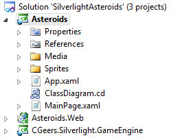
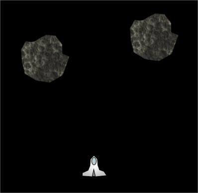
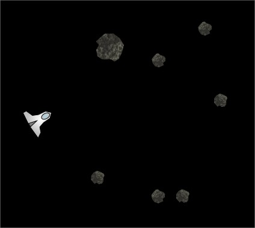

# Silverlight Asteroids Part 10: Asteroid Fragments

## Introduction

Time to bring the asteroids series to a conclusion. Let's finish the game and make it a bit more interesting in this tenth and final part.

Right now when you shoot an asteroid it blows up and dissapears, but more often than not this would cause the asteroid to break into multiple fragments. Let's modify the game and break up the asteroid into multiple parts when it gets shot.

## AsteroidSize Enum

Start from the [source code of part 9](../part-9/README.md), unzip it and open it up in Visual Studio 2010.

**Figure 1** - Solution Explorer



Add a new file called AsteroidSize.cs to the Sprites folder of the Asteroids project and add the following enum to it.

**Listing 1** - AsteroidSize Enum

```csharp
public enum AsteroidSize
{
    Small = 25,
    Medium = 50,
    Large = 100
}
```

## IAsteroidDesign Interface

Open the IAsteroidDesign interface found in the Sprites\\Design folder (Asteroids.Sprites.Design namespace) and add a new AsteroidSize property to it.

**Listing 2** - IAsteroidDesign interface

```csharp
public interface IAsteroidDesign : ISpriteDesign
{
    AsteroidSize AsteroidSize { get; }
}
```

The AsteroidDesign user control (Asteroids.Sprites.Design namespace) implements the IAsteroidDesign interface. Let's update the user control so that it implements the new AsteroidSize property.

**Listing 3** - AsteroidDesign User Control

```csharp
public partial class AsteroidDesign : UserControl, IAsteroidDesign
{
    private readonly AsteroidSize _asteroidSize;

    public AsteroidDesign(AsteroidSize asteroidSize)
    {
        InitializeComponent();

        this._asteroidSize = asteroidSize;
        this.SetSize();

        // ... rest of the code ...
    }

    private void SetSize()
    { }

    public AsteroidSize AsteroidSize
    {
        get { return this._asteroidSize; }
    }

    // ...
}
```

This class contains a private field called \_asteroidSize which is initialized by setting it to the AsteroidSize passed in through the control's constructor. The SetSize() method resizes the asteroid and the AsteroidSize property returns the current size of the asteroid.

The SetSize() method adjusts the sprite's width and height based on the size specified by the AsteroidSize enum.

**Listing 4** - SetSize() Method

```csharp
private void SetSize()
{
    int actualSize = (int) this._asteroidSize;
    this.Width = actualSize;
    this.Height = actualSize;
    this.AsteroidPath.Width = actualSize;
    this.AsteroidPath.Height = actualSize;
}
```

As you can see in Listing 1 I've attributed certain numeric values to each asteroid size. This value determines the size of the asteroid.

## Fragments

If you compile now you'll receive an error. This is because we added a parameter to the constructor of the AsteroidDesign user control (see Listing 3). Open the code-behind for the MainPage (MainPage.xaml.cs) and navigate to the CreateAsteroids() method. Here you create the initial asteroids. We start with large asteroids so specify the size when creating them as shown in the following listing.

**Listing 5** - CreateAsteroids() Method

```csharp
private void CreateAsteroids()
{
    Random randomizer = new Random();
    for (int i = 0; i < 3; i++)
    {
        double x = randomizer.Next((int)this.Width);
        double y = randomizer.Next((int)this.Height);
        Point randomLocation = new Point(x, y);
        new Asteroid(new AsteroidDesign(AsteroidSize.Large), randomLocation);
    }
}
```

If you run the game now you'll notifice that the size of the asteroids has increased.

**Figure 2** - Large Asteroids



Let's blow these big rocks up into smaller pieces. Open the Asteroid class in Visual Studio and take a look at it's Collision(...) method.

**Listing 6** - Collision(...) Method

```csharp
public override void Collision(Sprite sprite)
{
    this.Destroy();
}
```

When an asteroid is hit by a bullet it is destroyed. We need to adjust this method so that large and medium asteroids are blown up into several smaller pieces. If a small asteroid is shot it is vaporized.

**Listing 7** - Fragmentation

```csharp
public override void Collision(Sprite sprite)
{
    this.Destroy();

    AsteroidSize asteroidSize = ((AsteroidDesign) this.Design).AsteroidSize;
    switch (asteroidSize)
    {
        case AsteroidSize.Large:
            this.BreakUp(AsteroidSize.Medium);
            break;
        case AsteroidSize.Medium:
            this.BreakUp(AsteroidSize.Small);
            break;
    }
}
```

Each asteroid is destroyed when it is hit by a bullet. However when a large or medium asteroid is shot we call the BreakUp(...) method. This method creates three new and smaller asteroids and launches them in different directions.

**Listing 8** - BreakUp(...) Method

```csharp
private void BreakUp(AsteroidSize asteroidSize)
{
    Random randomizer = new Random();
    for (int i = 0; i < 3; i++)
    {
        Point location = new Point(this.X + randomizer.Next(10, 30),
                                    this.Y + randomizer.Next(20, 50));
        double angle = randomizer.Next(0, 360);
        new Asteroid(new AsteroidDesign(asteroidSize), location, angle);
    }
}
```

For this to work you need to add an additional constructor overload to the Asteroid class which also initializes the angle at which the asteroid is travelling through space.

**Listing 9** - Asteroid Constructor

```csharp
public Asteroid(IAsteroidDesign design, Point initialLocation, double angle)
    : base(design, initialLocation)
{
    this._angle = angle;
}
```

Run the game and start blasting away. You'll notice that the asteroids break up into smaller parts which are each launched in different direction because of the explosion.

**Figure 3** - Asteroid Fragments



## Summary

I hope you enjoyed the Asteroids series and learned something on the way. Breaking up an asteroid into smaller pieces basically comes down to destroying the asteroid and creating three new asteroid sprites, albeit smaller. This makes the game more fun and intense as you get more asteroids flying around in space, which increases the danger to your spaceship.

During the next weeks if I find the time I'll pour all ten parts of this series into a PDF and create one big single download (including the source code) so that you can more easily browse through it.
