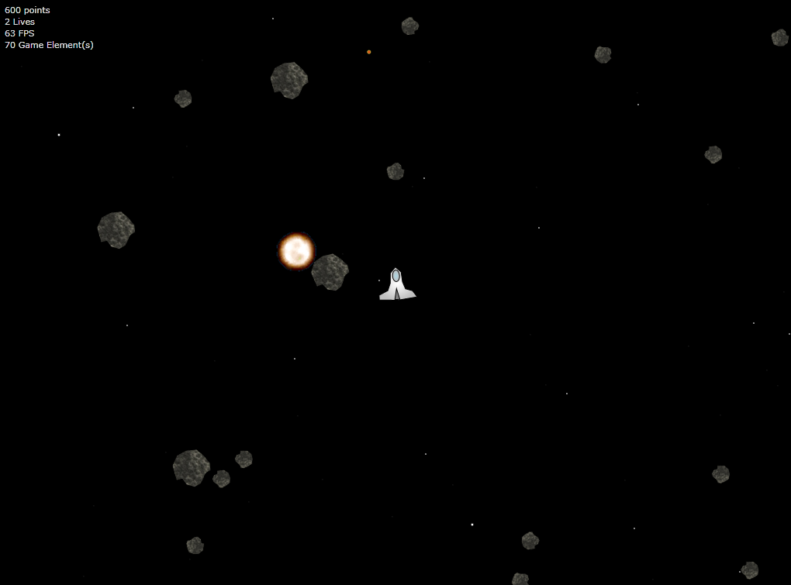
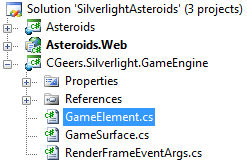
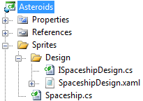
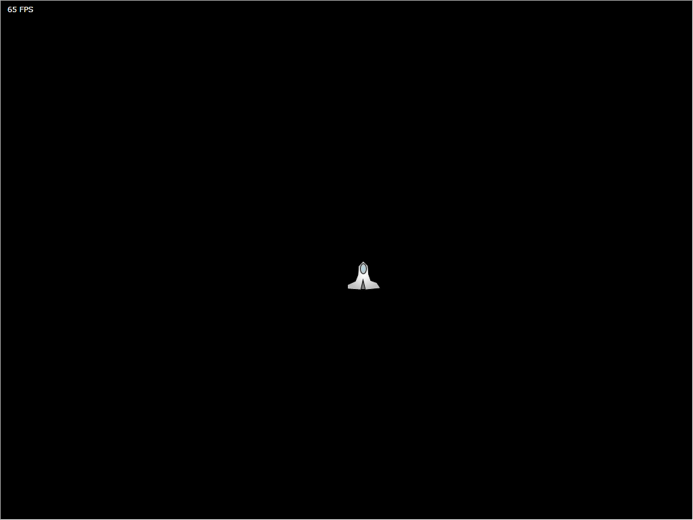

# Silverlight Asteroids Part 2: Sprites

## Introduction

In part 1 of this series we covered how you can easily set up a main game loop that fires an event each time a frame needs to be rendered.

By attaching an event handler to this event you can take the necessary steps to render all of your game elements or sprites onto the screen (game surface).

Take a quick look at the first part if you haven't done this already:

[Silverlight Asteroids Part 1: Game Loop](../part-1/README.md)

We'll pick up where we left last time.

This articles focuses on implementing a base class for all of the sprites that will be used in the game. Once that is done, we'll launch our spaceship into action!

Let's get started...

## Sprites

So what exactly is a sprite? In computer graphics, a sprite, is a two-dimensional image or animation that is part of a large scene. Sounds simple and it is. Just take a look at the following figure and see how many sprites you can identify.

**Figure 1** - Asteroids In Action



The screenshot of our Asteroids game in action contains the following sprites:

- Spaceship
- Asteroids
- Stars
- Explosions
- Bullets

These are basically all the sprites we need to create for the game. As you can imagine, some basic behavior is shared by each sprite. They are all part of the same scene (or game surface), have an image for the visual representation, a location ([Point](http://msdn.microsoft.com/en-us/library/system.windows.point.aspx)) on screen...etc.

## Game Element

Before you start creating a base class for all of the sprites let's create an abstract class that serves as the root for the inheritance hierarchy for all possible game elements that the game may contain, not just sprites. Add a new class called GameElement to the CGeers.Silverlight.GameEngine class library.

**Figure 2** - The Solution



Add the code shown in Listing 1.

**Listing 1** - GameElement Class

```csharp
public abstract class GameElement : IDisposable
{
    protected GameElement() : base()
    {
        GameSurface gameSurface = GameSurface.GetInstance();

        gameSurface.AddGameElement(this);
        this.ParentCanvas = gameSurface.Canvas;
    }

    public abstract void Update(TimeSpan elapsedTime);

    public Canvas ParentCanvas { get; private set; }

    // Disposable Pattern Implementation
    // ...
}
```

Each time a new game element is created it registers itself with the game surface, which is a singleton, by calling the GameSurface's AddGameElement(...) method and passing in itself as the parameter.

The GameElement type also implements the [IDisposable interface](http://msdn.microsoft.com/en-us/library/system.idisposable.aspx). I used the [Disposable pattern](http://msdn.microsoft.com/en-us/magazine/cc163392.aspx) to implement this interface.

Complete the GameElement class by adding the following code to it.

**Listing 2** - IDisposable Pattern

```csharp
private void Dispose(bool disposing)
{
    if (!this._disposed)
    {
        if (disposing)
        {
            // Clean up any managed resources here.
            // ...
        }

        // Clean up any unmanaged resources here.
        // ...

        // Unregister the game element with the surface
        GameSurface.GetInstance().RemoveGameElement(this);

        this._disposed = true;
    }
}

public void Dispose()
{
    Dispose(true);
    GC.SuppressFinalize(this);
}

~GameElement()
{
    Dispose(false);
}
```

Implementing the Disposable pattern makes sure that the game element unregisters itself from the game surface when it's being disposed, no matter who disposes of it. Be it a developer or the .NET garbage collector. Either way the GameSurface's RemoveGameElement(...) method will be called.

## Game Surface

Try to compile the code now. Will it compile? No. If you take a look at the code shown in listing 1 and 2 you'll see a few methods and properties for the GameSurface type that you need to add first.

You need to add the AddGameElement(...) and RemoveGameElement(...) methods. These just add or remove GameElement instances to / from a private generic list. Open up the GameSurface.cs file and add the following code to the GameSurface class.

**Listing 3** - GameSurface Class

```csharp
public Canvas Canvas { get; set; }

private List<GameElement> _gameElements = new List<GameElement>();

public void AddGameElement(GameElement gameElement)
{
    this._gameElements.Add(gameElement);
}

public void RemoveGameElement(GameElement gameElement)
{
    int indexOf = this._gameElements.IndexOf(gameElement);
    if (indexOf != -1)
    {
        this._gameElements.Remove(gameElement);
    }
}
```

The GameSurface type also contains a reference to a Canvas upon which all of the game elements will be drawn. When a GameElement instance is created its ParentCanvas property will be initialized and will reference the same Canvas instance. It has a private setter so you can't change it afterwards.

Open up the code-behind file for the MainPage page in the Asteroids Silverlight project and initialize the GameSurface's Canvas property right before you start the game.

**Listing 4** - Setting The Canvas

```csharp
public MainPage()
{
    InitializeComponent();

    this._gameSurface.Canvas = this.LayoutRoot;
    this._gameSurface.RenderFrame += RenderFrame;
    this._gameSurface.StartGame();
}
```

## Sprite Design

If you'll bing for Silverlight games you'll find alot of implementations where a Sprite base class is a subclass of the [UserControl](<http://msdn.microsoft.com/en-us/library/system.windows.controls.usercontrol(VS.95).aspx>) type. This works fine, but it tightly couples the actual visual representation of the sprite with the code that defines its behavior. I went another route with it and decoupled the visual representation of a sprite from its behavior.

Let's dig up an OO principle and program to an interface, not an implementation. Add a new file called ISpriteDesign to the CGeers.Silverlight.GameEngine project and add the following code to it.

**Listing 5** - ISpriteDesign Interface

```csharp
public interface ISpriteDesign
{
    UIElement UIElement { get; }
}
```

As you'll see in a bit, when creating a sprite you need to specify an implementation of the ISpriteDesign interface. For now this interface has a [UIElement](<http://msdn.microsoft.com/en-us/library/system.windows.uielement(VS.95).aspx>) property which represents the visual representation of the sprite.

**Remark**: Using the UserControl type as the base class for another type is a bit problematic in Silverlight as the designer generated code (\*.g.cs) overrides your Sprite base class with the UserControl type everytime it is regenerated. This is another reason why I've chosen not to do this.

## Sprite Base Class

You're now finally ready to create the bass class from which all sprites will descend. Add a new file Sprite.cs to the CGeers.Silverlight.GameEngine project and add the code shown in Listing 6 to it.

**Listing 6** - Sprite

```csharp
public abstract class Sprite : GameElement
{
    protected Sprite(ISpriteDesign design, Point initialLocation)
        : base()
    {
        this.Design = design;

        this.ParentCanvas.Children.Add(this.Design.UIElement);

        X = initialLocation.X;
        Y = initialLocation.Y;
    }

    public ISpriteDesign Design { get; set; }

    public double X
    {
        get
        {
            return (double) this.Design.UIElement.GetValue(Canvas.LeftProperty);
        }
        set
        {
            this.Design.UIElement.SetValue(Canvas.LeftProperty, value);
        }
    }

    public double Y
    {
        get
        {
            return (double) this.Design.UIElement.GetValue(Canvas.TopProperty);
        }
        set
        {
            this.Design.UIElement.SetValue(Canvas.TopProperty, value);
        }
    }
}
```

The abstract Sprite class does not contain much code at the moment. We'll be expanding this class later on in this series to support things such as collision detection, parent canvas boundaries...etc. The most important thing to note is that it adds the design of the sprite (ISpriteDesign.UIElement) to the canvas of the game surface (Sprite.ParentCanvas -> GameSurface.Canvas).

For now you need to specify a design (ISpriteDesign) when creating a new sprite and an initial location ([Point](http://msdn.microsoft.com/en-us/library/system.windows.point.aspx)). The sprite will be rendered using the design you specified and will initially be placed on the GameSurface's canvas at the given location.

## Spaceship Design

Before you create the spaceship sprite you need to create the design for it. In the Asteroids Silverlight project add a new folder named Sprites and add a subfolder to this newly created folder called Design.

**Figure 3** - Sprite Designs



Add a new interface to the Designs folder named ISpaceshipDesign. It descends from the ISpriteDesign interface found in the CGeers.Silverlight.GameEngine class library but does not add anything to it for now.

**Listing 7** - ISpaceshipDesign Interface

```csharp
public interface ISpaceshipDesign : ISpriteDesign
{ }
```

Next add a new Silverlight User Control called SpaceshipDesign to the Design folder and make sure it implements the ISpaceshipDesign interface.

**Listing 8** - SpaceshipDesign User Control

```csharp
public partial class SpaceshipDesign : UserControl, ISpaceshipDesign
{
    public SpaceshipDesign()
    {
        InitializeComponent();
    }

    public UIElement UIElement
    {
        get { return this; }
    }
}
```

The ISpaceshipDesign interface only requires that you return a UIElement instance. Since you are using a user control you can return the control itself as it descends from the UIElement type.

The visual representation for the spaceship is entirely made up out of XAML. I've not listed the XAML code in this article as it is quite lengthy. Just download the source code accompanying this article and copy / paste the XAML for the SpaceshipDesign user control.

Your spaceship should look like this:

**Figure 4** - The Spaceship


(Once again, thanks to [Andy Beaulieu](http://www.andybeaulieu.com/) for letting me borrow his XAML design for this spaceship.)

## Spaceship Sprite

You're almost there. Just one more thing to do before the spaceship sprite is finished. Add a new class called Spaceship to the Sprites folder in the Asteroids project. Then add the following code to it:

**Listing 9** - Spaceship Sprite

```csharp
public class Spaceship : Sprite
{
    public Spaceship(ISpaceshipDesign design, Point initialLocation)
        : base(design, initialLocation)
    { }

    public override void Update(TimeSpan elapsedTime)
    { }
}
```

Voila, the spaceship sprite is ready to be used. In later parts of this series we'll be adding behavior to this sprite that allows it to move around the canvas, shoot bullets, crash into comets (as a result of bad steering)...etc.

Now open up the code-behind file for the MainPage and add the following code to it.

**Listing 10** - Creating The Spaceship

```csharp
private Spaceship _spaceShip;

private void CreateSpaceShip()
{
    Point centerPoint = new Point(LayoutRoot.ActualWidth / 2, LayoutRoot.ActualHeight / 2);
    this._spaceShip = new Spaceship(new SpaceshipDesign(), centerPoint);
}
```

This method creates a new spaceship instance and places it in the middle of the canvas. Be sure to insert a call to the CreateSpace() method before you call the GameSurface's StartGame() method in the MainPage's constructor.

Launch the Asteroids Silverlight application and you should see your spaceship at the center of the screen.

**Figure 5** - Spaceship Launched!



## Summary

Well that was quite some work you had to do in order to display a simple XAML based graphic upon a canvas. However you've now setup all the necessary plumbing that will allow you to easily create additional sprites such as bullets, asteroids, stars...etc. You just need to follow these simple steps:

- Add a new Silverlight User Control
- Make sure the user control implements the ISpriteDesign interface (or a descendant)
- Add a new class descending from the abstract Sprite class
- Create a new instance of the sprite and pass in the correct user control as the design of the sprite

Using this method you can easily decouple the visual design of a sprite from its behavior. Want a new look for your spaceship? No problem just fire up Expression Blend, design it and paste the XAML in a new user control.

In the next part we'll cover how we can make the spaceship move around the canvas by using the keyboard. Until then, happy coding.
