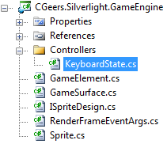

# Silverlight Asteroids Part 3: Keyboard Control

## Introduction

If you haven't read the first two parts of this series, I encourage you to read those. At least have a quick browse so that you know where we left off.

- [Silverlight Asteroids Part 1: Game Loop](../part-1/README.md)
- [Silverlight Asteroids Part 2: Sprites](../part-2/README.md)

At the end of part 2 we created a sprite for our spaceship and launched it into space. However it's engine is not responding to our commands and it's just floating in space motionless and silent.

Let's learn how we can use the keyboard to control the spaceship. Let's kick start the spaceship's engine...

## Keyboard Controls

We want the spaceship to respond to the following keys:

- **Up Arrow**: Ignite the engine for a short burst. This will give the ship a forward momentum in the direction its currently pointing.
- **Left Arrow**: Rotate the ship around its axis in a counter-clockwise direction
- **Right Arrow**: Rotate the ship around its axis in a clockwise direction

**Figure 1** - Keyboard Controls


## Querying The Keyboard State

In order to determine if the player pressed a key you need a way to query the current keyboard state. Dave Wheeler suggests a great, but easy mechanism in his excellent article on [game development using Silverlight 2](http://www.vsj.co.uk/articles/display.asp?id=721).

Add a new folder to the CGeers.Silverlight.GameEngine project, called Controllers. Add a new class called KeyboardState in this folder.

**Figure 2** - Solution Explorer



Add the following code to this file:

**Listing 1** - KeyboardState Class

```csharp
public static class KeyboardState
{
    private const int MAX_KEYS = 256;
    private static bool[] _states = new bool[MAX_KEYS];

    public static bool GetKeyState(Key key)
    {
        int index = (int) key;
        if (index < 0 || index >= MAX_KEYS)
        {
            return false;
        }
        return _states[index];
    }

    public static void SetKeyState(Key key)
    {
        int index = (int) key;
        if (index < 0 || index >= MAX_KEYS)
        {
            return;
        }
        _states[index] = true;
    }

    public static void HookEvents(UIElement uiElement)
    {
        if (uiElement != null)
        {
            uiElement.KeyDown += OnKeyDown;
            uiElement.KeyUp += OnKeyUp;
        }
    }

    public static void UnhookEvents(UIElement uiElement)
    {
        if (uiElement != null)
        {
            uiElement.KeyDown -= OnKeyDown;
            uiElement.KeyUp -= OnKeyUp;
        }
    }

    private static void OnKeyUp(object sender, KeyEventArgs e)
    {
        _states[(int) e.Key] = false;
    }

    private static void OnKeyDown(object sender, KeyEventArgs e)
    {
        _states[(int) e.Key] = true;
    }
}
```

The KeyboardState class is static, which makes sense. Each computer only has one keyboard. Most the times, anyway.

You can instruct the KeyboardState class to monitor the KeyDown and KeyUp events of a UIElement type with the HookEvents(UIElement uiElement) method. Don't want to monitor the keyboard events for a UIElement anymore? Just call the UnhookEvents(UIElement uiElement) method.

Open up the code-behind for the application file (App.xaml.cs) for the Asteroids project and adjust the code for the Application_Startup(...) method as shown in Listing 2.

**Listing 2** - Monitor The Keyboard

```csharp
private void Application_Startup(object sender, StartupEventArgs e)
{
    this.RootVisual = new MainPage();
    KeyboardState.HookEvents(this.RootVisual);
}
```

Each key press within the RootVisual will now be monitored. At any given moment in time you can query the current keyboard status using the KeyboardState class.

## Rotating The Spaceship

Open the code-behind for the Mainpage.xaml and add the following code to the bottom of the RenderFrame(...) method. We added this event handler in part 1 of the series.

**Listing 3** - Query KeyboardState

```csharp
// What should the space ship do?
if (KeyboardState.GetKeyState(Key.Left) == true)
{
    this._spaceShip.TurnLeft(e.ElapsedTime);
}
if (KeyboardState.GetKeyState(Key.Right) == true)
{
    this._spaceShip.TurnRight(e.ElapsedTime);
}
```

For each rendered frame we query the keyboard state. If the left arrow is pressed we rotate the ship counter-clockwise, if the right arrow key is pressed we rotate it clockwise.

As you can see we call two methods of the SpaceShip class, namely TurnLeft(...) and TurnRight(...). The SpaceShip class does not yet have these methods. Open up the Spaceship.cs file found in the Asteroids project and add the following methods to it.

**Listing 4** - Spaceship Class

```csharp
public void TurnLeft(TimeSpan elapsedTime)
{
    ((ISpaceshipDesign) this.Design).RotateTransform.Angle -=
        250 * elapsedTime.TotalSeconds;
}

public void TurnRight(TimeSpan elapsedTime)
{
    ((ISpaceshipDesign) this.Design).RotateTransform.Angle +=
        250 * elapsedTime.TotalSeconds;
}
```

The TurnLeft(...) and TurnRight(...) methods basically do the same thing. The design of the spaceship (ISpaceshipDesign interface) exposes a RotateTransform property. We just adjust the angle of this transform accordingly.

No matter which design you end up using for the spaceship it needs to implement a RotateTransform. We enforce this by adding such a property to the ISpaceshipDesign interface.

**Listing 5** - ISpaceshipDesign Interface

```csharp
public interface ISpaceshipDesign : ISpriteDesign
{
    RotateTransform RotateTransform { get; }
}
```

The XAML code for the spaceship design was already added to the Asteroids project in part 2. Examine it and you'll find a [RotateTransform](http://msdn.microsoft.com/en-us/library/system.windows.media.rotatetransform.aspx) called RotateShip. The rotation center point of the RotateTransform for the XAML spaceship is set to the center of the spaceship itself so that it rotates in place.

Now you only need to implement the interface for the spaceship design and return this RotateShip transformation.

**Listing 6** - SpaceshipDesign.xaml.cs

```csharp
public RotateTransform RotateTransform
{
    get { return this.RotateShip; }
}
```

Compile the solution and start the game. Press the left and right keys and you'll notice that you can rotate the spaceship around its axis.

## Fire Up The Engines!

Moving the spaceship forward follows the same pattern as rotating it. First add the following code to the RenderFrame(...) method found in the MainPage.xaml.cs file.

**Listing 7** - Handling the Up Arrow Key

```csharp
if (KeyboardState.GetKeyState(Key.Up) == true)
{
    this._spaceShip.Thrust();
    this._spaceShip.TurnOnEngine();
}
else
{
    this._spaceShip.Drift();
    this._spaceShip.TurnOffEngine();
}
```

Now you need to add the Thrust(), Drift(), TurnOnEngine and TurnOffEngine() methods to the Spaceship class.

**Listing 8** - TurnOnEngine and TurnOffEngine() Methods

```csharp
public void TurnOnEngine()
{
    ((ISpaceshipDesign) this.Design).ThrustVisibility = Visibility.Visible;
}

public void TurnOffEngine()
{
    ((ISpaceshipDesign) this.Design).ThrustVisibility = Visibility.Collapsed;
}
```

The TurnOnEngine() method makes sure the player sees that the engine is turned on by shooting flames out of the exhaust! The TurnOffEngine() method extinguishes the flames.

Because it's a visible effect it is part of the design interface (ISpaceshipDesign). The interface needs to expose a Visibility property for the engine. Go ahead and add this property to the ISpaceshipDesign interface.

**Listing 9** - ThrustVisibility Property

```csharp
public interface ISpaceshipDesign : ISpriteDesign
{
    RotateTransform RotateTransform { get; }
    Visibility ThrustVisibility { get; set; }
}
```

The XAML code that defines the design of the spaceship already contains an ellipse to render the flames. Expose this ellipse's visibility property by implementing the new ThrustVisibility property on the SpaceshipDesign class.

**Listing 10** - SpaceshipDesign.xaml.cs

```csharp
public Visibility ThrustVisibility
{
    get { return ShipThrust.Visibility; }
    set { this.ShipThrust.Visibility = value; }
}
```

**Figure 3** - Fire Up The Engines!


## Thrust

Open up the Spaceship.cs file and add the following private instance variables to the Spaceship class.

**Listing 11** - Spaceship Private Instance Variables

```csharp
private double _speed = 0;
private double _angle = 0;
private DateTime _lastThrust;
private const double InitialThrustSpeed = 3;
private const double DecelerationRate = .015;
```

Next add the private method Propel() and the public method Thrust().

**Listing 12** - Propel() & Thrust Methods

```csharp
private void Propel()
{
    // Convert degrees to radians. Multiply by PI and divide by 180.
    // Result : A number or expression representing the angle in radians.
    double radians = Math.PI * this._angle / 180.0;

    // Calculates the sine of x. This will be a value from -1.0 to 1.0.
    X += Math.Sin(radians) * this._speed;

    // Calculates the cosine of x. This will be a value from -1.0 to 1.0.
    Y -= Math.Cos(radians) * this._speed;
}

public void Thrust()
{
    // At which angle do we need to propel the ship?
    // The angle is expressed in degrees.
    this._angle = ((ISpaceshipDesign) this.Design).RotateTransform.Angle;

    // Boost the speed
    this._speed = InitialThrustSpeed;

    // Remember when the last thrust occurred
    this._lastThrust = System.DateTime.Now;

    // Propel the ship
    Propel();
}
```

The Thrust() method is called each time a frame is rendered and the up arrow key is pressed. It determines which angle the spaceship is facing, sets the initial speed and propels the ship forward. The Propel() method uses this information (angle, speed...etc.) to calculate the new X and Y values for the spaceship's position on the canvas.

**Remark**: This article does not explain the mathematics behind moving an object in a 2D space. I want to stay focused on the main subject for this part. The mathematics (vectors, vector normalization, sinus, cosinus...etc.) behind this deserves its own blog post. Maybe if I have time someday I'll write a post about it. Until then, use your favorite search engine.

## Drift

When you release the up arrow key now, the spaceship will come to a complete halt. That does not feel natural. By turning on the engines you gave the spaceship a boost that propels it forward. After turning off the engines by releasing the up arrow key, the spaceship still has a forward momentum. It should still continue to drift further into space for a while.

That's why we call the Drift() method of the Spaceship class for each frame when the up arrow key is not being pressed. Go ahead and add this method to the Spaceship class. The code is listed here below.

**Listing 13** - Drift Method

```csharp
public void Drift()
{
    // Have we run out of steam?
    if (this._speed <= 0)
    {
        return;
    }

    // Reduce the speed
    TimeSpan span = DateTime.Now - this._lastThrust;
    this._speed -= (DecelerationRate * (span.Milliseconds * .002));

    // Propel the ship
    Propel();
}
```

Each time the Drift() method is called the spaceship's speed is reduced until it reaches zero. The Propel() method is then used to calculate the new position of the ship.

## Summary

Go ahead and run the application. You are now able to control your spaceship and fly it around in space. However if you cross the boundaries of the canvas you'll notice that the spaceship will disappear. In the next part I'll show you, how you can make the spaceship reappear on the other side of the canvas.

Again, you had to perform quite a bit of work in order to perform a simple task. In order to be able to control the spaceship you have to:

- Query the current keyboard state
- Rotate the spaceship using a RotateTransform
- Move the spaceship forward by applying mathematics
- Create visual effects (exhaust flames...etc.)
