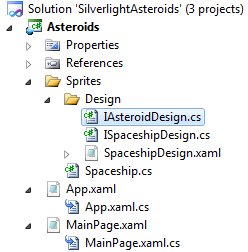
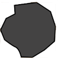
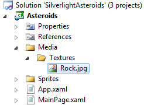
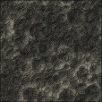
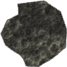
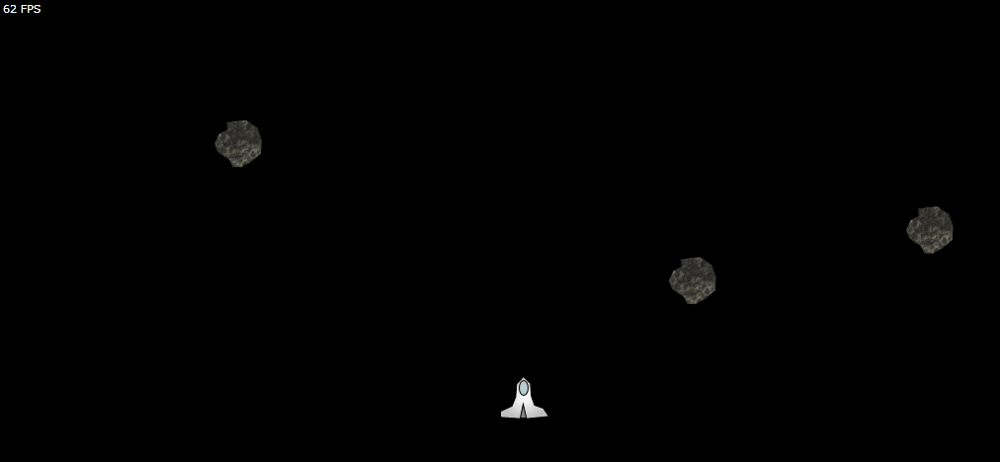

# Silverlight Asteroids Part 5: Asteroids

## Introduction

We're already at part 5 of the Silverlight Asteroids series. This time, you'll finally get to hurl some asteroids into space. Just like the spaceship, an asteroid is a sprite. If you remember "[Part 2: Sprites](../part-2/README.md)", then you'll know that in order to add a new sprite to the game you've got to follow these steps:

- Add a new Silverlight User Control
- Make sure the user control implements the ISpriteDesign interface (or a descendant)
- Add a new class descending from the abstract Sprite class
- Create a new instance of the sprite and pass in the correct user control as the design of the sprite

If this does not ring a bell, have a quick peek at [part 2](../part-2/README.md) first. Without further talk, let's walk through each of these steps.

## IAsteroidDesign Interface

Add a new file (interface) called IAsteroidDesign.cs to the Asteroids project under the "Sprites\\Design" folder.

**Figure 1** - Solution Explorer



Add the following code to this file:

**Listing 1** - IAsteroidDesign Interface

```csharp
public interface IAsteroidDesign : ISpriteDesign
{ }
```

The IAsteroidDesign interface descends from the ISpriteDesign interface found in the CGeers.Silverlight.GameEngine class library. For now, it does not contain any additional properties or methods. It just serves as a placeholder. In a future part of this series we'll add more code to this interface.

## Asteroid User Control

Now add a new Silverlight User Control to the "Sprites\\Design" folder called "AsteroidDesign.xaml". Afterwards open up the code-behind of this new user control and implement the IAsteroidDesign interface.

**Listing 2** - AsteroidDesign.xaml.cs

```csharp
public partial class AsteroidDesign : UserControl, IAsteroidDesign
{
    public AsteroidDesign()
    {
        InitializeComponent();
    }

    public UIElement UIElement
    {
        get { return this; }
    }
}
```

Open the XAML view for the user control and add the following XAML markup to define the visual representation for the asteroid.

**Listing 3** - AsteroidDesign XAML

```xml
<UserControl x:Class="Asteroids.Sprites.Design.AsteroidDesign"
    xmlns="http://schemas.microsoft.com/winfx/2006/xaml/presentation"
    xmlns:x="http://schemas.microsoft.com/winfx/2006/xaml"
    Width="50" Height="50">

    <Canvas x:Name="AsteroidCanvas" Background="Transparent">

        <Path x:Name="AsteroidPath" Fill="#FF444343" Stretch="Fill"
              Stroke="#FF000000" Width="50" Height="50" Canvas.Left="0"
              Canvas.Top="0" Data="M251,96 L211,101 212,116 196,124
              186,144 193,161 C193,161 206,171 213,174 220,177 223,191
              223,191 L243,192 265,179 283,164 285,138 276,112 z"
              RenderTransformOrigin="0.5,0.5">
            <Path.RenderTransform>
                <TransformGroup>
                    <ScaleTransform/>
                    <RotateTransform/>
                </TransformGroup>
            </Path.RenderTransform>
        </Path>

    </Canvas>
</UserControl>
```

Your asteroid should look like this:

**Figure 2** - XAML Asteroid



## Rock Texture

To give the asteroid a fancier look I applied an image brush to it. Create the folders "Media\\Textures" in the Asteroids project.

**Figure 3** - Media\\Textures folder



Download the image (Figure 4) displayed here and save it as Rock.jpg under the "Media\\Textures" folder. Set this resource's "Build Action" property to "Content" and the "Copy to Output Directory" property to "Copy if newer".

**Figure 4** - Rock Texture



Go back to the code-behind of the AsteroidDesign user control and adjust its constructor as shown in Listing 4.

**Listing 4** - Apply The ImageBrush

```csharp
public AsteroidDesign()
{
    InitializeComponent();

    // Texture
    ImageBrush brush = new ImageBrush();
    Uri uri = new Uri("/Media/Textures/Rock.jpg", UriKind.Relative);
    brush.ImageSource = new BitmapImage(uri);
    this.AsteroidPath.Fill = brush;
}
```

Your asteroid now looks a lot more life-like.

**Figure 5** - Texturized XAML Asteroid



## Asteroid Sprite

Add a new class called Asteroid to the Sprites folder. Add the code shown in Listing 5 to it.

**Listing 5** - Asteroid Class

```csharp
public class Asteroid : Sprite
{
    private double _angle = 0;
    private const int AsteroidSpeed = 1;

    public Asteroid(IAsteroidDesign design, Point initialLocation)
        : base(design, initialLocation)
    {
        Random randomizer = new Random();
        this._angle = randomizer.Next(0, 360);
    }

    public override void Update(TimeSpan elapsedTime)
    {
        double radians = Math.PI * this._angle / 180.0;

        X += Math.Sin(radians) * AsteroidSpeed;
        Y -= Math.Cos(radians) * AsteroidSpeed;

        this.KeepSpriteWithinParentCanvasBounds();
    }

    public override bool HasMovedBeyondRightBound
    {
        get
        {
            return this.X >= this.ParentCanvas.Width - this.Design.Width;
        }
    }

    public override bool HasMovedBeyondBottomBound
    {
        get
        {
            return this.Y >= this.ParentCanvas.Height - this.Design.Height;
        }
    }
}
```

As you can see each asteroid gets a random angle (\_angle variable), at which it floats through space, when it is created. Since the Asteroid class descends from the [Sprite type](../part-2/README.md) (CGeers.Silverlight.GameEngine namespace) it is automatically added to the [GameSurface](../part-2/README.md). Everytime when a frame needs to be rendered each sprite's Update(...) method will be called. Here we calculate the new position of the asteroid based on its angle and speed.

**Remark**: I've also overriden the HasMovedBeyondRightBound and HasMovedBeyondBottomBound properties of the Sprite base class to give the asteroid a little bit different behaviour when it crosses the boundaries of space (a.k.a. the GameSurface's canvas). Check out "[Part 4: Space](../part-4/README.MD)" for more information.

## Asteroids In Space

Everything is in place. Time to introduce some asteroids to the game. Open the code-behind for the MainPage.xaml and add the following method to it.

**Listing 6** - CreateAsteroids() Method

```csharp
private void CreateAsteroids()
{
    Random randomizer = new Random();
    for (int i = 0; i < 3; i++)
    {
        double x = (double) randomizer.Next((int)this.Width);
        double y = (double) randomizer.Next((int)this.Height);
        Point randomLocation = new Point(x, y);
        new Asteroid(new AsteroidDesign(), randomLocation);
    }
}
```

Call the CreateAsteroids() method from the MainPage's constructor just before you call the StartGame() method of the GameSurface singleton. Start the game, and you've got asteroids...in space!

**Figure 6** - Asteroids



## Rotation

When you start the game, you'll notice that the asteroids float through space at a steady pace. But in order to complete the asteroid sprite we need to add a little pizzaz. In my mind's eye asteroids rotate around their axis. This can be achieved by adding a storyboard to the XAML that makes up the asteroid.

Open the XAML view for the AsteroidDesign user control and add the following story board.

**Listing 7** - AsteroidDesign.xaml Resources

```xml
<UserControl.Resources>
    <Storyboard x:Name="Rotate" RepeatBehavior="Forever">
        <DoubleAnimationUsingKeyFrames
                Storyboard.TargetName="AsteroidPath"
                Storyboard.TargetProperty="(UIElement.RenderTransform).
                    (TransformGroup.Children)[1].(RotateTransform.Angle)"
                BeginTime="00:00:00">
            <SplineDoubleKeyFrame KeyTime="00:00:00" Value="0"/>
            <SplineDoubleKeyFrame KeyTime="00:00:08" Value="359"
                                    x:Name="EndRotationInSeconds" />
        </DoubleAnimationUsingKeyFrames>
    </Storyboard>
</UserControl.Resources>
```

This story board targets the angle property of the asteroid's RotateTransform property (see Listing 3). The value of the angle changes from 0 to 359 (full circle) in 8 seconds.

Open the code-behind for the AsteroidDesign user control and add the following code to its constructor in order to start the story board.

**Listing 8** - Start The StoryBoard

```csharp
// Rotation
Random randomizer = new Random();
this.EndRotationInSeconds.KeyTime = new TimeSpan(0, 0, randomizer.Next(3, 8));
this.Rotate.Begin();
```

As you can the speed for a full rotation is randomly chosen between 3 and 8 seconds. Some asteroids will rotate faster than others. These little details add more depth to your game.

## Summary

You now have a set of three asteroids floating around in space. Each asteroid has a different angle and rotates around its axis at a random speed. By leveraging the work you did in [part 2](../part-2/README.md) of this series, you can easily add a new sprite to the game without much fuss. This frees up time so you can concentrate more on the behavior of the new sprite.

The spaceship's existence is now threatened by the asteroids. In the next part we’ll have to arm the spaceship so that it can blow up these rocks. Until then, happy coding.
