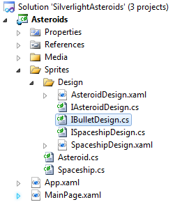
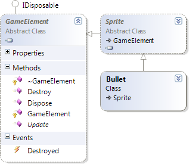

# Silverlight Asteroids Part 6: Fire!

## Introduction

In the [previous part](../part-5/README.md) we finally added some asteroids to the game. Those pesky rocks are now floating around in space, at record breaking speed, forming a major risk for our spaceship!

Time to arm the spaceship so it can defend itself. A gun loaded with high-velocity, copper-plated, hollow-point bullets will do the trick.

Just like a spaceship or an asteroid a bullet represents a [sprite](../part-2/README.md) in the game. To weaponize the spaceship, you'll need to follow the exact same steps as you went through earlier in part 2 and 5.

Let's get started...

## IBulletDesign Interface

Add a new file (interface) called IBulletDesign.cs to the Asteroids project under the "Sprites\\Design" folder.

**Figure 1** - Solution Explorer



The IBulletDesign interface descends from the ISpriteDesign interface found in the CGeers.Silverlight.GameEngine class library. For now, it does not contain any additional properties or methods. It just serves as a placeholder. I just like to define a separate interface for each sprite's design. If I want to extend the design of a sprite in the future, I'll at least have a place where I can do this.

**Listing 1** - IBulletDesign Interface

```csharp
public interface IBulletDesign : ISpriteDesign
{ }
```

## Bullet User Control

Now add a new Silverlight User Control to the "Sprites\\Design" folder called "BulletDesign.xaml". Afterwards open up the code-behind of this new user control and implement the IBulletDesign interface.

**Listing 2** - BulletDesign.xaml.cs

```csharp
public partial class BulletDesign : UserControl, IBulletDesign
{
    public BulletDesign()
    {
        InitializeComponent();
    }

    public UIElement UIElement
    {
        get { return this; }
    }
}
```

Open the XAML view for the user control and add the following XAML markup to define the visual representation for the bullet.

**Listing 3** - BulletDesign XAML

```xml
<UserControl x:Class="Asteroids.Sprites.Design.BulletDesign"
    xmlns="http://schemas.microsoft.com/winfx/2006/xaml/presentation"
    xmlns:x="http://schemas.microsoft.com/winfx/2006/xaml"
    Width="7" Height="7">
    <Canvas x:Name="LayoutRoot" Width="7" Height="7">
        <Path Height="7" x:Name="RootPath" Width="7" Stretch="Fill"
              Stroke="#FF000000"
              Data="M6.5,4.5 C6.5,6.7091389 5.1568542,8.5 3.5,8.5
                    C1.8431457,8.5 0.5,6.7091389 0.5,4.5
                    C0.5,2.2908609 1.8431457,0.5 3.5,0.5
                    C5.1568542,0.5 6.5,2.2908609 6.5,4.5 z">
            <Path.Fill>
                <RadialGradientBrush>
                    <GradientStop Color="#FFE81909" Offset="0"/>
                    <GradientStop Color="#FFC6E145" Offset="1"/>
                </RadialGradientBrush>
            </Path.Fill>
        </Path>
    </Canvas>
</UserControl>
```

Your bullet should look like this:

**Figure 2** - XAML Bullet


This picture is enlarged. In reality it's a small orange dott, but trust me...it packs quite a punch.

## Bullet Sprite

Add a new class called Bullet to the Sprites folder. Add the code shown in Listing 4 to it.

**Listing 4** - Bullet Class

```csharp
public class Bullet : Sprite
{
    private double _angle = 0;
    private const int BulletSpeed = 5;

    public Bullet(ISpriteDesign design, Point initialLocation, double angle)
        : base(design, initialLocation)
    {
        this._angle = angle;
    }

    public override void Update(TimeSpan elapsedTime)
    {
        double radians = Math.PI * this._angle / 180.0;

        X += Math.Sin(radians) * BulletSpeed;
        Y -= Math.Cos(radians) * BulletSpeed;

        if (this.HasMovedOutOfParentCanvasBounds)
        {
            this.Destroy();
        }
    }
}
```

When a bullet is created it is passed an angle. This is the angle at which the bullet moves, and it is the same angle as the spaceship faced when it fired the bullet.

Just like the Spaceship and Asteroid sprite, the Bullet type descends from the [Sprite type](../part-2/README.md) (CGeers.Silverlight.GameEngine namespace). Therefor it is automatically added to the [GameSurface](../part-2/README.md). Everytime when a frame needs to be rendered each sprite's Update(...) method will be called. Here we calculate the new position of the bullet based on its angle and speed.

## Picking Up The Shells

As you can see in Listing 4, whenever a bullet moves out of the bounds defined by the parent canvas it is destroyed by calling the GameElement's Destroy() method. We don't want the bullets to appear at the other end of the canvas like the spaceship and asteroids do.

**Figure 3** - Class Diagram



As you can see in this class diagram, the Bullet type descends from the Sprite type which in turn descends from the GameElement type. Open the GameElement.cs file found in the CGeers.Silverlight.GameEngine project and add the following code to the GameElement class.

**Listing 5** - GameElement Destroy() Method & Destroyed Event

```csharp
public event EventHandler Destroyed;

public virtual void Destroy()
{
    GameSurface.GetInstance().RemoveGameElement(this);
    if (this.Destroyed != null)
    {
        this.Destroyed(this, new EventArgs());
    }
}
```

When you call this method the sprite will be removed from the GameSurface's internal GameElement collection and will no longer receive any update notifications. Since the GameSurface no longer contains any references to this object it will soon be cleaned up by .NET's garbage collection.

**Remark**: The Destroyed event will come in handy in a future part of this series.

Now edit the Sprite class, found in the same class library, and override the Destroy() method as shown in Listing 6. For a sprite you also need to make sure it is removed from the GameSurface's canvas.

**Listing 6** - Sprite Destroy() Method

```csharp
public override void Destroy()
{
    this.ParentCanvas.Children.Remove(this.Design.UIElement);
    base.Destroy();
}
```

## The Gun

Time to mount the gun on the spaceship. Add the following properties to the ISpaceshipDesign interface.

**Listing 7** - ISpaceshipDesign Interface

```csharp
Point GunLocation { get; }
double Angle { get; }
```

The SpaceshipDesign user control needs to inform you where the gun is placed on the spaceship and which angle it is pointing at . Implement these new properties as follows:

**Listing 8** - SpaceshipDesign User Control

```csharp
public Point GunLocation
{
    get
    {
        double x = (double) this.GetValue(Canvas.LeftProperty) + 21;
        double y = (double) this.GetValue(Canvas.TopProperty) + 17;
        return new Point(x, y);
    }
}

public double Angle
{
    get { return this.RotateShip.Angle; }
}
```

By retrieving the GunLocation property from the SpaceshipDesign user control you know where the gun is mounted on the spaceship. The Angle property tells you the angle which the spaceship is currently facing by returning the Angle property of its RotateTransform.

Let's assemble the gun. Add a new class called Gun to the Sprites folder in the Asteroids project. Add the code shown in Listing 9 to it.

**Listing 9** - Gun Class

```csharp
public class Gun
{
    private ISpaceshipDesign _spaceshipDesign;
    private DateTime _lastTimeFired = DateTime.Now;

    public Gun(ISpaceshipDesign spaceshipDesign)
    {
        this._spaceshipDesign = spaceshipDesign;
    }

    public bool IsReloading
    {
        get
        {
            TimeSpan pause = new TimeSpan(0, 0, 0, 0, 300);
            bool reloading = this._lastTimeFired > DateTime.Now.Subtract(pause);
            return reloading;
        }
    }

    public void Fire()
    {
        if (IsReloading)
        {
            return;
        }

        Point gunLocation = _spaceshipDesign.GunLocation;
        double angle = _spaceshipDesign.Angle;

        Bullet bullet = new Bullet(new BulletDesign(), gunLocation, angle);

        this._lastTimeFired = DateTime.Now;
    }
}
```

Each time you call the Fire() method a bullet is fired. You can only fire one bullet each 300 milliseconds. This is how long it takes for the gun to load the next bullet into the chamber.

## Arm The Spaceship

Open the Spaceship.cs file and add a Gun property to the Spaceship sprite. Make sure this property's private backing field is initialized in the Spaceship's constructor.

**Listing 10** - Mount The Gun

```csharp
public Spaceship(ISpaceshipDesign design, Point initialLocation)
    : base(design, initialLocation)
{
    this._gun = new Gun(design);
}

private Gun _gun;
public Gun Gun
{
    get { return this._gun; }
}
```

## Fire!

The spaceship is now fully armed! Time for some action. Open the code-behind for the MainPage page and add the following code to the bottom of the RenderFrame() event handler. Each time you press the spacebar the gun will be fired!

**Listing 11** - Fire!

```csharp
private void RenderFrame(object sender, RenderFrameEventArgs e)
{
    // ...other code...
    if (KeyboardState.GetKeyState(Key.Space) == true)
    {
        this._spaceShip.Gun.Fire();
    }
}
```

## Summary

Run the game and start blasting away at the asteroids! The spaceship will fire bullets, one each 300 milliseconds, in the direction it is facing. Once again by leveraging the work you did in [part 2](../part-2/README.md) of this series, you can easily add a new sprite (bullet) to the game. After that, you only need to create a Gun class which you need to "mount" on the spaceship.

The spaceship is now able to counter the treat posed by the asteroids. However you'll notice that nothing happens when a bullet hits one of the asteroids. At the moment, collisions are not detected. Collision detection will be the focus of the next part in this series.
