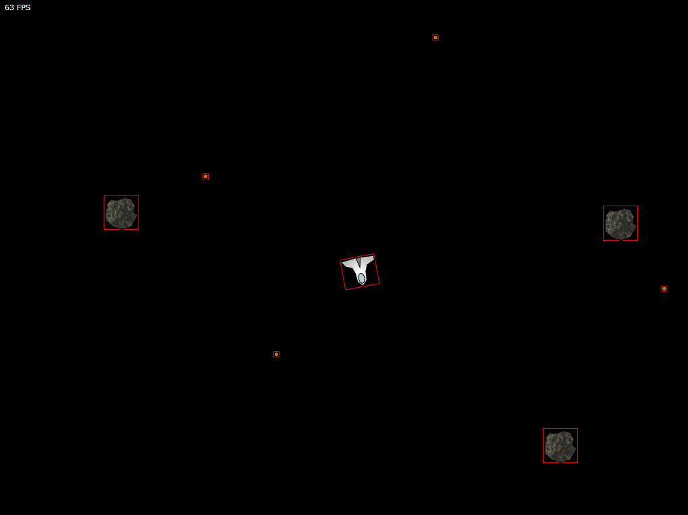

# Silverlight Asteroids Part 7: Collision Detection

## Introduction

In the last part of this series we finally armed the spaceship. It is now able to fire bullets. However nothing happens when a bullet hits one of the asteroids or if one of the asteroids hits the spaceship. Let's add some simple collision detection algorithm that notifies us when such crashes occur.

Start with he source code of [part 6](../part-6/README.md) and open it up in Visual Studio 2010.

Let's get started...

## Collision Manager

Open the code-behind file for the MainPage and add the following two lines just before you call the GameSurface's StartGame() method.

**Listing 1** - MainPage() Constructor

```csharp
public MainPage()
{
    InitializeComponent();
    //...
    CollisionManager.Register<Asteroid, Bullet>();
    CollisionManager.Register<Spaceship, Asteroid>();
    //...
}
```

The CollisionManager type is responsible for detecting collisions between sprite objects. Here you register that you want to be notified when a collision occurs when a bullet hits an asteroid and when an asteroid collides with the spaceship (or vica versa).

Add a new class called "CollisionManager" to the CGeers.Silverlight.GameEngine code library. The skeleton code for this class looks as follows:

**Listing 2** - CollisionManager Class

```csharp
public class CollisionManager
{
    private static Dictionary<Type, List<Type>> _collisionMap =
        new Dictionary<Type, List<Type>>();

    #region Singleton Pattern

    // Static members are lazily initialized.
    // .NET guarantees thread safety for static initialization.
    private readonly static CollisionManager _instance =
        new CollisionManager();

    // Make the constructor private to hide it.
    // This class adheres to the singleton pattern.
    private CollisionManager()
    { }

    /// <summary>
    /// Return the single instance of the CollisionManager type.
    /// </summary>
    /// <returns>CollisionManager</returns>
    public static CollisionManager GetInstance()
    {
        return _instance;
    }

    #endregion

    public static void Register<Target, Projectile>()
        where Target : Sprite
        where Projectile : Sprite
    { }

    public void DetectCollisions()
    { }
}
```

## Collision Map

As you can see in Listing 2 the CollisionManager type adheres to the singleton pattern and keeps a list (collision map) of sprite types for which it should detect collisions.

By calling the Register(...) method you register between which sprite types you would like to detect collisions. Internally the CollisionManager adds these types to a dictionary. For each target it keeps a list of projectiles by which it can be hit.

**Listing 3** - Register(...) Method

```csharp
private static void AddToCollissionMap(Type target, Type projectile)
{
    if (!_collisionMap.ContainsKey(target))
    {
        _collisionMap.Add(target, new List<Type>());
    }
    if (!_collisionMap[target].Contains(projectile))
    {
        _collisionMap[target].Add(projectile);
    }
}

public static void Register<Target, Projectile>()
    where Target : Sprite
    where Projectile : Sprite
{
    Type targetType = typeof(Target);
    Type projectileType = typeof(Projectile);

    AddToCollissionMap(targetType, projectileType);
    AddToCollissionMap(projectileType, targetType);
}
```

## Detecting Collisions

Once you've registered all the sprite types, you need to instruct the CollisionManager to look out for possible collisions for each rendered frame. Therefor open the code-behind file for the MainPage and add the following line of code to the bottom of the RenderFrame(...) method.

**Listing 4** - RenderFrame(...) Method

```csharp
private void RenderFrame(object sender, RenderFrameEventArgs e)
{
    //...
    CollisionManager.GetInstance().DetectCollisions();
}
```

Each time a frame is rendered the CollisionManager detects if one of the registered sprite types causes a collision.

Go back to the CollisionManager.cs file and add the following code to the DetectCollisions() method. This method retrieves a list of sprites that are currently on the game surface and then checks if it needs to detect a collision for each of these sprites.

**Listing 5** - CollisionManager's DetectCollisions() Method

```csharp
public void DetectCollisions()
{
    GameSurface surface = GameSurface.GetInstance();
    List<Sprite> sprites = new List<Sprite>(surface.Sprites);
    for (int i = 0; i < sprites.Count; i++)
    {
        Sprite projectile = sprites[i];

        for (int j = i + 1; j < sprites.Count; j++)
        {
            Sprite target = sprites[j];

            Type projectileType = projectile.GetType();
            Type targetType = target.GetType();

            bool checkForCollission =
                _collisionMap.ContainsKey(projectileType) &&
                _collisionMap[projectileType].Contains(targetType);

            if (checkForCollission)
            {
                //...
            }
        }
    }
}
```

In order to retrieve a list of the sprites currently on the game surface add the following property to the GameSurface type found in the CGeers.Silverlight.GameEngine project.

**Listing 6** - GameSurface's Sprites Property

```csharp
public IEnumerable<Sprite> Sprites
{
    get
    {
        var q = from e in this._gameElements.OfType<Sprite>()
                select e;
        return q;
    }
}
```

## Bounding Rectangles

Imagine a red border being drawn around the spaceship, asteroids and bullets.

**Figure 1** - Red Border



When these rectangles intersect we have a collision. Sure it's not a pixel perfect algorithm, but it will do for now. Open up the Sprite.cs file found in the CGeers.Silverlight.GameEngine library and add the following code to it.

**Listing 7** - Sprite Class

```csharp
public Point Location
{
    get { return new Point(this.X, this.Y); }
}

public Size Size
{
    get { return new Size(this.Design.Width, this.Design.Height); }
}

public Rect BoundsRect
{
    get { return new Rect(this.Location, this.Size); }
}

public virtual void Collision(Sprite sprite)
{ }
```

The Location property returns the location of the sprite (upper left corner) and the Size property returns the size of the sprite using the ISpriteDesign interface's Width and Height property. Using the Location and Size property you can create a BoundsRect property which returns a rectangle which is about the size of your sprite, provided you set the design's height and width correctly.

Go back to the CollisionManager.cs file and insert the following code in the DetectCollisions() method right after the if (checkForCollission) test (see Listing 5).

**Listing 8** - Intersecting Rectangles

```csharp
// Simple collision check
Sprite sprite = projectile as Sprite;
Rect rect1 = projectile.BoundsRect;
Rect rect2 = target.BoundsRect;
rect1.Intersect(rect2);

if (rect1 != Rect.Empty)
{
    projectile.Collision(target);
    target.Collision(projectile);
}
```

## Collisions

When checking if two sprites collide the CollisionManager retrieves their bounding rectangles and checks if they intersect. If that's the case then the sprite's Collision(...) method will be called. You can override this method for each of your sprites and perform an action like showing an explosion.

Go ahead and override the Collision(...) method for the Asteroid, Bullet and Spaceship sprite. For each of these sprites execute the code shown in Listing 9.

**Listing 9** - Sprite's Collision(...) Method

```csharp
public override void Collision(Sprite sprite)
{
    this.Destroy();
}
```

You need to make a few more adjustments for the spaceship sprite. Open up the code-behind file for the MainPage and define an event handler for the spaceship's Destroyed event.

**Listing 10** - Spaceship Destroyed Event Handler

```csharp
private void CreateSpaceShip()
{
    //...
    this._spaceShip.Destroyed += SpaceShipDestroyed;
}

void SpaceShipDestroyed(object sender, EventArgs e)
{
    this._spaceShip = null;
}
```

Now when controlling the spaceship's actions from the RenderFrame(...) method you need to check if it is not null.

**Listing 11** - Check if the spaceship sprite has been destroyed

```csharp
private void RenderFrame(object sender, RenderFrameEventArgs e)
{
    //...
    // What should the space ship do?
    if (this._spaceShip != null)
    {
        //...
    }
    //...
}
```

## Summary

Run the game and start blasting away. You'll notifice when your bullets hit an asteroid that both the asteroid and the bullet will disappear. The same holds true when the spaceship is hit by an asteroid.

Before starting the game you need to tell the CollisionManager for which sprite types it should check for collisions. It then checks for collisions for each rendered frame. If a collision is detected the sprite objects in question will be notified by calling their Collision(...) method. Passed into this method is the other sprite object with which they are colliding.

By overriding each sprite's Collision(...) method you can take an appropriate action like showing an explosion and removing the sprite from the game surface.

In the next part of this series we'll improve this very crude collision algorithm. It needs to be pixel perfect, now it only checks if the sprites' bounding rectangles intersect. Depending on the form of the sprites they might not actually collide.
