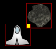

# Silverlight Asteroids Part 8: Pixel-Perfect Collision Detection

## Introduction

Time to put the last finishing touches on the collision detection algorithm that we introduced in the last part of this series. The current algorithm that is in place functions correctly but sometimes you get a feeling that something is not quite right.

At the moment each sprite has a bounding rectangle and when one sprite's bounding rectangle intersects with another sprite's bounding rectangle we flag it as a collission. An image says more than a thousand words, so let's see what can go wrong with this approach.

**Figure 1** - Intersecting Bounding Rectangles



As you can see the sprites bounding rectangles intersect, but the spaceship and asteroid do not actually collide with each other. Let's see how we can improve on this design.

## ISpriteDesign Interface

Start from the source code of [part 7](../part-7/README.md) and open it up in Visual Studio 2010. If you take a look at Listing 5 & 8 of part 7 you'll notice that the [CollisionManager](../part-7/README.md) checks if sprites collide by checking if their bounding rectangles intersect.

We can leave this preliminary check in place, however when we detect an intersection we have to perform an additional check that makes sure the sprites are actually touching each other. We need to inspect each pixel within the intersection (the yellow square displayed in Figure 1). But before we continue, you need to add two properties to the ISpriteDesign interface found in the CGeers.Silverlight.GameEngine library.

**Listing 1** - ISpriteDesign Interface

```csharp
public interface ISpriteDesign
{
    UIElement UIElement { get; }
    double Width { get; set; }
    double Height { get; set; }
    Canvas LayoutRoot { get; }
    Path RootPath { get; }
}
```

The properties LayoutRoot (Canvas) and RootPath (Path) need to be implemented by every design (spaceship, asteroid and bullet). If you compile now, the compiler will complain that the designs for the sprites do not yet implement these new properties. Go ahead and implement them, it's quite straightforward. Each design (XAML) already contains a canvas and a path. Listing 2 shows you the code for the SpaceshipDesign.

**Listing 2** - SpaceshipDesign.xaml.cs Code-Behind

```csharp
public partial class SpaceshipDesign : UserControl, ISpaceshipDesign
{
    // ...

    public Canvas LayoutRoot
    {
        get { return this.Ship; }
    }

    public Path RootPath
    {
        get { return this.SpaceShipPath; }
    }
}
```

Look at the previous parts if you want to check out how these properties are implemented for the designs of the asteroid and bullet sprites.

## Collision Manager

Time to expand the collision algorithm found in the CollisionManager type (CGeers.Silverlight.GameEngine assembly). Open this class and navigate to its DetectCollisions() method. It contains the following if-check.

**Listing 3** - CollisionManager.DetectCollisions()

```csharp
if (rect1 != Rect.Empty)
{
  // ...
}
```

When this if-check returns true we know that two sprites' bounding rectangles are intersecting. Time to inspect each pixel found within this intersection. Paste the code shown in Listing 4 inside of the if-check.

**Listing 4** - Inspecting Pixels

```csharp
bool bCollision = false;
Point ptCheck = new Point();

// Accurate pixel hit test by checking every pixel in the first BoundsRect.
for (int x = Convert.ToInt32(rect1.X); x < Convert.ToInt32(rect1.X + rect1.Width); x++)
{
    for (int y = Convert.ToInt32(rect1.Y); y < Convert.ToInt32(rect1.Y + rect1.Height); y++)
    {
        // ...
    }
    if (bCollision)
    {
        break;
    }
}
if (bCollision)
{
    projectile.Collision(target);
    target.Collision(projectile);
}
```

As you can see we have two loops that make sure we check each pixel of the intersection and if we detect a collision in the inner loop then we break out of them and notify the sprites that a collision occurred.

Time to complete the DetectCollisions() method. Insert the code shown in Listing 5 inside of the inner loop shown in the previous listing.

**Listing 5** - Collision Detection

```csharp
ptCheck.X = x;
ptCheck.Y = y;

List<UIElement> hits = (List<UIElement>)
    VisualTreeHelper.FindElementsInHostCoordinates(ptCheck, projectile.Design.LayoutRoot);
if (hits.Contains(projectile.Design.RootPath))
{
    List<UIElement> hits2 = (List<UIElement>)
        VisualTreeHelper.FindElementsInHostCoordinates(ptCheck, target.Design.LayoutRoot);
    if (hits2.Contains(target.Design.RootPath))
    {
        bCollision = true;
        break;
    }
}
```

When we inspect a pixel we ask for all of the UIElements it contains using the [VisualTreeHelper type](<http://msdn.microsoft.com/en-us/library/system.windows.media.visualtreehelper(v=VS.95).aspx>)'s [FindElementsInHostCoordinates() method](<http://msdn.microsoft.com/en-us/library/cc838402(v=VS.95).aspx>). If it contains the projectile and target's RootPath then we have a collision.

**Remark**: This collision detection algorithm was based on the version provided by [Andy Beaulieu](http://www.andybeaulieu.com/Home/tabid/67/EntryID/160/Default.aspx) who was also kind enough to let me use this XAML designs for the game.

## Summary

Fire up the game and start blasting away. If you pay close attention you should notice that a collision only occurs when the sprites design's actually collide! Test it by flying your spaceship as close as possible to one of the asteroids.

When the CollisionManager detects an intersection between two sprites' bounding rectangles it then proceeds to inspect each pixel of that intersection to make sure that the sprites really collide. If not then no collision will be triggered.

This method is suitable for a small game such as this, but when you are dealing with a large number of sprites it can grind your frame rate to a halt. It is quite a resource hog.

Now that collision detection is out of the way, we'll focus on some more cool stuff in the next part of this series. Let's blow some stuff up. When we have a collision it would be neat to show an animated explosion.
