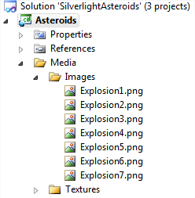
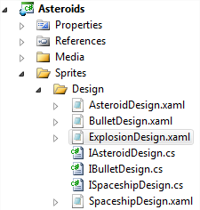
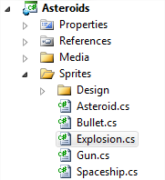
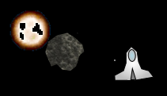

# Silverlight Asteroids Part 9: Explosions

## Introduction

The spaceship is armed and can blast away at the asteroids. But as it stands now, the asteroids just disappear when they are hit by a bullet. Let's put a cool explosion effect in the game.

To make this happen we'll have to introduce an animated sprite into the game which simulates an explosion. Download the source code for part 8, open it in Visual Studio 2010 and let's blow some stuff up.

## IAnimatedSpriteDesign Interface

Add a new interface called IAnimatedSpriteDesign to the CGeers.Silverlight.GameEngine class library.

**Listing 1** - IAnimatedSpriteDesign Interface

```csharp
public interface IAnimatedSpriteDesign : ISpriteDesign
{
    void Update(TimeSpan elapsedTime);
    bool IsCompleted { get; }
}
```

In order to simulate an explosion effect we're going to show 7 images in quick succession just like an [animated GIF](http://en.wikipedia.org/wiki/Animated_gif#Animated_GIF). This interface defines an Update(...) method which will be triggered each time a frame is rendered. The IsCompleted (bool) property tells us when the animation has finished rendering.

Go to the Asteroids Silverlight project and add the seven images which make up the explosion effect to the Images subfolder of the Media folder.

**Figure 1** - Media Elements



You can find these images in the [`images` directory](./images) of this part.

## ExplosionDesign User Control

Add a new Silverlight User Control called ExplosionDesign to the Asteroids project under the Sprites\\Design folder (`Explosion1.png` through `Explosion7.png`).

**Figure 2** - ExplosionDesign User Control



The XAML code for this user control consists out of a simple image.

**Listing 2** - ExplosionDesign User Control XAML

```xml
<UserControl x:Class="Asteroids.Sprites.Design.ExplosionDesign"
    xmlns="http://schemas.microsoft.com/winfx/2006/xaml/presentation"
    xmlns:x="http://schemas.microsoft.com/winfx/2006/xaml"
    Width="55" Height="55">
    <Canvas x:Name="ExplosionCanvas" Background="Transparent">
        <Image x:Name="Image"
               Source="/Asteroids;component/Media/Images/Explosion1.png"
               Canvas.Left="0" Canvas.Top="0" />
    </Canvas>
</UserControl>
```

This user control only displays the first of seven images that make up the explosion. We need to change the source of the Image control each time a frame is rendered until we reach the end of the animation. We need to implement the IAnimatedSpriteDesign interface to achieve this.

**Listing 3** - Implementing the IAnimatedSpriteDesign Interface

```csharp
public partial class ExplosionDesign : UserControl, IAnimatedSpriteDesign
{
    private bool _stop = false;

    public ExplosionDesign()
    {
        InitializeComponent();
    }

    public void Update(TimeSpan elapsedTime)
    {
        // Change the explosion image for each rendered frame.
    }

    public bool IsCompleted
    {
        get { return this._stop; }
    }

    public UIElement UIElement
    {
        get { return this; }
    }

    public Canvas LayoutRoot
    {
        get { return this.ExplosionCanvas; }
    }

    public Path RootPath
    {
        get { return null; }
    }
}
```

## The Animation

In order to animate the explosion we need to notify the ExplosionDesign user control each time a new frame needs to be rendered. Start by adding a new class (Sprite) called Explosion to the Sprites folder.

**Figure 3** - Explosion Sprite



Have the Explosion class descend from the Sprite class (CGeers.Silverlight.GameEngine namespace) and override the Update(...) method as follows:

**Listing 4** - Explosion Class

```csharp
public class Explosion : Sprite
{
    public Explosion(IAnimatedSpriteDesign design, Point initialLocation)
        : base(design, initialLocation)
    { }

    public override void Update(TimeSpan elapsedTime)
    {
        IAnimatedSpriteDesign design = (IAnimatedSpriteDesign) this.Design;
        design.Update(elapsedTime);

        if (design.IsCompleted)
        {
            this.Destroy();
        }
    }
}
```

The [GameSurface type](../part-1/README.md) notifies each sprite when a new frame needs to be rendered by calling their Update(...) method. Here we capture this event and notify the sprite's design (the ExplosionDesign user control). When the animation has completed (IsCompleted property) we dispose of it.

Ok, now for the actual animation itself. Go back to the ExplosionDesign user control and change it's Update(...) method as shown in Listing 5.

**Listing 5** - ExplosionDesign User Control Update(...) Method

```csharp
private bool _stop = false;
private int _currentFrame = 0;
private TimeSpan _lastTick = TimeSpan.Zero;
private readonly TimeSpan _animationDelay = TimeSpan.FromSeconds(.05);

public void Update(TimeSpan elapsedTime)
{
    if (this._currentFrame == 7)
    {
        Visibility = Visibility.Collapsed;
        this._stop = true;
        return;
    }

    this._lastTick += elapsedTime;
    if (this._lastTick > this._animationDelay)
    {
        this._lastTick -= this._animationDelay;

        string filename =
            String.Format("/Asteroids;component/Media/Images/Explosion{0}.png",
            this._currentFrame);
        Image.Source = new BitmapImage(new Uri(filename, UriKind.Relative));

        this._currentFrame += 1;
    }
}
```

Each time a new frame is rendered we check if a certain delay has passed and if so then we update the user control's image source property.

**Remark**: The file patch is hardcoded in this example. You might want to improve on this design.

## Kaboom

Everything is in place now. Time to make sure our bullets detonate on impact. Open the Bullet class (Sprite) and update it's Collision(...) method as shown below.

**Listing 6** - Explode on Impact

```csharp
public override void Collision(Sprite sprite)
{
    this.Destroy();

    Point locationOfExplosion = new Point(
        this.X - sprite.Design.Width / 2,
        this.Y - this.Design.Height / 2);
    new Explosion(new ExplosionDesign(), locationOfExplosion);
}
```

Each time a bullet collides with another sprite we calculate the position of the impact and show an explosion animation at that particular point in space. You can do the same thing for the spaceship when it collides with another sprite. When the spaceship collides with an asteroid we blow it up. Just override the Spaceship type's Collision(...) method as shown in Listing 7.

**Listing 7** - Blowing up the Spaceship

```csharp
public override void Collision(Sprite sprite)
{
    this.Destroy();
    new Explosion(new ExplosionDesign(), new Point(this.X, this.Y));
}
```

You don't need to calculate the position for the explosion animation. Just use the spaceship's current location (X & Y properties).

That's it. Run the game and start blowing stuff up!

**Figure 4** - Kaboom



## Summary

In this part of the Silverlight Asteroids series you learned how you can easily add support for animated sprites. Using these sprites you can quickly add cool effects to the game like explosions.

When a bullet or the spaceship collides with another sprite we display an explosion animation at the point of impact. That is all there is too it. In the next part of this series we'll add another cool effect. When an asteroid is hit by a bullet (or by the spaceship) we will break it up into multiple little pieces. This makes the game more intense as you get more asteroids flying around in space, which increases the danger to your spaceship.
